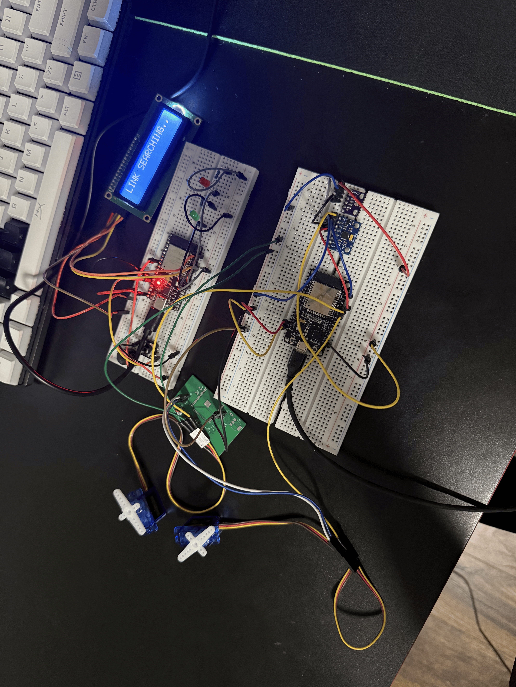

# ESP32 Dual-Axis Thrust Vector Control (TVC) Flight Computer

An embedded 6-DOF flight computer designed for active thrust vector control, real-time wireless ground station telemetry, and high-rate flash logging. Built around the **ESP32**, **MPU-6050** IMU, and **BMP280** barometric sensor.



---

## Key Features

* **Dual-Axis Active Stabilization:** Controls Pitch and Yaw servos using sensor fusion logic bounded within $\pm 30^\circ$ deflection limits.
* **Low-Noise Filter Pipeline:** Employs an Exponential Moving Average (EMA) low-pass filter on orientation angles to eliminate motor servo jitter caused by high-G accelerometer noise.
* **High-Rate Flash Logging:** Writes telemetry data at ~30 Hz directly to onboard **LittleFS** physical flash memory with immediate buffer flushing (`logFile.flush()`) to prevent data loss during power brownouts.
* **5 Hz Wireless Telemetry:** Broadcasts telemetry packets over **ESP-NOW** to a ground telemetry station.
* **Deterministic State Machine:** Robust state engine (`ARMED` $\rightarrow$ `FLIGHT` $\rightarrow$ `DESCENT` $\rightarrow$ `LANDED`) with manual serial debug overrides (`reset` & `dump`).

---

## Hardware Specifications & Pinout

| Component | Interface / Pin | Description |
| :--- | :--- | :--- |
| **Microcontroller** | ESP32-WROOM-32 | Dual-core @ 240 MHz, LittleFS, ESP-NOW Wireless |
| **Pitch Servo** | GPIO 18 (PWM) | Dedicated PWM Timer 0 allocation (50 Hz) |
| **Yaw Servo** | GPIO 19 (PWM) | Dedicated PWM Timer 0 allocation (50 Hz) |
| **IMU (MPU-6050)** | I2C (SDA: 21, SCL: 22) | 6-DOF Accelerometer & Gyroscope ($\pm 8g$ range) |
| **Barometer (BMP280)**| I2C (Address 0x76/0x77) | High-precision altitude tracking with I2C recovery |

---

## Telemetry Log & Flight Performance

Flight performance data captured during test logging (stored in [`telemetry/espnowfile.csv`](espnowfile.csv)):

* **Peak Altitude:** `0.61 m` (Barometric filtered)
* **Peak Acceleration:** `1.40 g`
* **Log Sample Rate:** ~30 Hz (~33ms log interval)
* **Attitude Limits:** Pitch range $[-5.4^\circ, +35.7^\circ]$, Yaw range $[-0.8^\circ, +15.9^\circ]$

---

## Repository Structure

```text
├── firmware/
│   └── TVC_Flight_Computer.ino     # Main ESP32 flight software
├── telemetry/
│   ├── espnowfile.csv              # Raw logged telemetry CSV dataset
│   └── plot_telemetry.py           # Python data analysis & plotting script
├── assets/
│   └── flight_telemetry_clean.png  # Generated telemetry visualization
└── README.md
